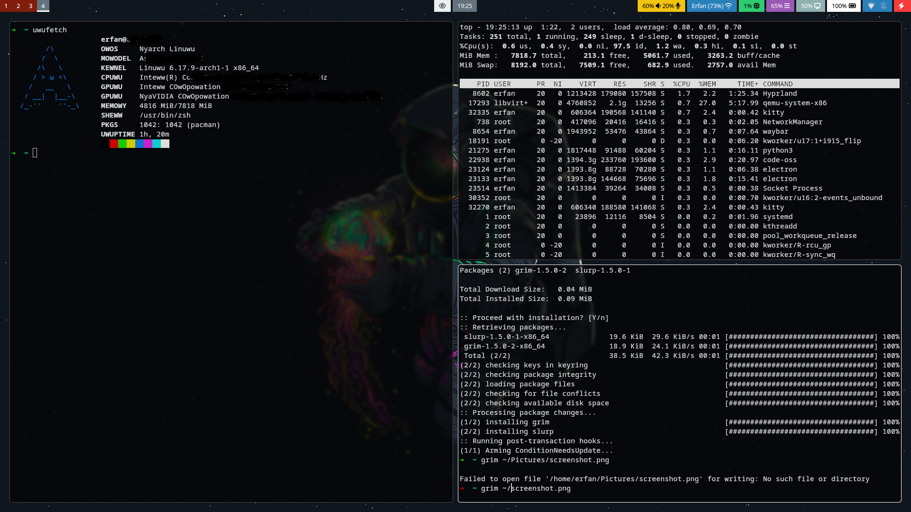

# ArchMinist DotFiles Installer

ArchMinist is a simple and minimalist Hyprland setup for Arch Linux that keeps everything clean and straightforward. I always try to use default configurations and keybinds, so the rice stays simple, lightweight, and practical. This setup is made for my personal workstation, so don’t expect heavy animations, blur effects, or fancy visual effects — I’m not a fan of them.

## Screenshots

Here are some screenshots of the setup:

## Requirements

Before running the installer, make sure you already have:

- A properly installed **base Arch Linux system**
- A **local user with sudo permissions**
- A working **internet connection**

I will create another script in the future for a complete minimal installation (including disk encryption and more). For now, you can use the official **archinstall** script for the base system installation.

And please note that this is a work in progress and I will try to make it better and better....

## Installation

1) Clone the repository:

git clone https://github.com/erfanmousavi-dev/archminist.git

2) Enter the directory:

cd archminist

3) Make the script executable:

chmod +x main.sh

4) Run the script as a normal user:

./main.sh

(Do NOT run the script as root or with sudo.)
If you liked the setup, feel free to give the project a ⭐ on GitHub :)